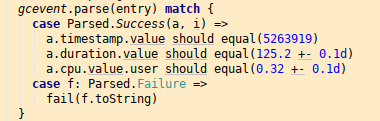

# Implicits


[David Crosson](https://github.com/dacr) -
  [@crodav](https://twitter.com/crodav)
  
Orange/IMT/OLS/IVA/I2P/XPERF

---

## Introduction

WE ARE ALL ALREADY using implicits !

* Consider this java code :  
  `System.out.println("The response : "+42)`
  - **42** is implicitly converted to a String
  - **"Response : "** is implicitly converted to a a mutable string such as a StringBuffer which provides an append like method

---

## So what are implicits ?

* 
  + [cambridge dictionary](http://dictionary.cambridge.org/dictionary/english/implicit) :
    - "*suggested but not communicated directly*"
    - So "implicits" in programming languages can be understood as something happening but not explicitly written ! kind of magic...

---

## But why ?


* to write less code & enhance readability,
  + `System.out.println(new StringBuilder("The response : ").append(42.toString).toString)`
* to be more DRY (Don't Repeat Youself),
* to enhance legacy APIs,
* to define **new domain specific languages**,...

---

## Quick test environment

* Install the [SBT](http://www.scala-sbt.org/) build tool
* `git clone https://github.com/dacr/dtdays2017.git`
* `cd dtdays2017`
* `sbt console` *(on first time execution, it will download all the required dependencies)*
	+ `println("Hello world")`
* Then just copy/paste following code snippets into the scala console to play with Implicits
  + some examples requires to have a `test` user
    - accessible using pubkey authentication from your current user

---

## Ninja turtle example
```scala
case class Point(x:Double, y:Double)
case class Turtle(id:String, pos:Point, angle:Double)

def distance(a:Point, b:Point):Double = sqrt(pow(b.x-a.x, 2)+pow(b.y-a.y, 2))
def angle(a:Point, b:Point):Double = atan2(b.y-a.y,b.x-a.x)

distance(Point(1d,1d),Point(2d,2d))

val leonardo = Turtle("leonardo",Point(1d,1d),0)
val donatello = Turtle("donatello",Point(2d,2d),0)

distance(leonardo.pos,donatello.pos)
```

---

## Adding implicit conversions

* Two implicits conversions from tuple or turtle to a point :
  ```
  implicit def tuple2point(in:(Double,Double)):Point = in match {case (a,b)=>Point(a,b)}
  implicit def turtle2point(in:Turtle):Point = in.pos
  ```
* Let's try :
  ```
  val leonardo = Turtle("leonardo",(1d,1d),0)
  val donatello = Turtle("donatello",(2d,2d),0)

  distance((1d,1d),(2d,2d))
  distance(leonardo,donatello)
  ```

---

## Adding operations

* Consider this implicit class :
  ```scala
  implicit class TurtlePlayRules(from:Turtle) {
    def forward(d:Double):Turtle =
      from.copy(pos=(from.x+cos(from.angle)*d, from.y+sin(from.angle)*d))
    def backward(d:Double):Turtle = forward(-d)
    def turnLeft(n:Int):Turtle = from.copy(angle=from.angle+PI/4*n)
    def turnRight(n:Int):Turtle = from.copy(angle=from.angle-PI/4*n)
  }
  ```
* Now we can write :
  ```
  leonardo forward 5 turnLeft 3 backward 1
  ```
  + which is transparently rewritten by the compiler as the following line :
    ```
    TurtlePlayRules(TurtlePlayRules(TurtlePlayRules(leonardo).forward(5)).turnLeft(3)).backward(1)
    ```

---

## And what have we done ?

* We've just created an internal Domain Specific Language (DSL) !
	+ without defining any new dedicated parsers
	+ just using the chosen programming language
	    - that's why it is called an "internal" DSL.
    + SO all language features are available for advanced users ;
	    - `(1 to 10).foldLeft(leonardo){case (turtle,d) => turtle forward d turnLeft 1}`

---

## Implicit values & parameters

* It's wonderful solution when you have to deal with contexts, configs, sessions, ... to stay DRY !
  ```scala
  case class GlobalConfig(baseuri:String, timeout:Int)

  def homepage()(implicit cfg:GlobalConfig) = {
    s"<html><body>baseuri is ${cfg.baseuri}</body></html>"
  }

  def route(request:String)(implicit cfg:GlobalConfig) = {
    request match {
      case ""  => homepage()
      case "/" => homepage()
    }
  }
  ```
  + And then :
    ```scala
    route("/") // will fail
    implicit val defaults:GlobalConfig = GlobalConfig("/base", 32)
    route("/")
    ```

---

## Implicit values & parameters

* Default implicit value ?
  + first the default implicit value is used & then overriden to change the ordering :
    ```scala
    List("a10","a1", "a2").sorted
    // List("a1", "a10", "a2")

    import fr.janalyse.tools.NaturalSort._

    List("a10","a1", "a2").sorted
    // List("a1", "a2", "a10")
    ```
    - The [sorted method](http://www.scala-lang.org/api/2.12.x/scala/collection/immutable/List.html) looks for an implicit parameter :
      ```scala
      def sorted[B >: A](implicit ord: math.Ordering[B]): List[A]
      ```
    - if no available implicit ordering is available in the current scope, the compiler will look into the [math.Ordering](http://www.scala-lang.org/api/2.12.x/scala/math/Ordering$.html) object for the default one.

---

## Implicit values & parameters
* let's illustrate how resolution works :
  ```
  trait Truc { def msg:String} ;  object Truc {
    implicit object DefaultTruc extends Truc {
      def msg = "muche !"
    }
  }
  ```
  + Note here the small tip to force the trait and the object to be compiled together within the console
    - _(I could have used `:paste` but it is not yet available for dotty console)_
* And now you can proceed with :
  ```
  def toto()(implicit truc:Truc) = "hello "+truc.msg

  println(toto())

  implicit val truc:Truc = new Truc { val msg="mucheII" }
  println(toto())
  ```

---

## Implicits Resolutions order

1. First look in current scope
	+ Implicits defined in current scope
	+ Explicit imports
	+ wildcard imports
	+ Same scope in other files
2. Now look at associated types in
	+ Companion objects of a type
	+ Implicit scope of an argument's type (2.9.1)
	+ Implicit scope of type arguments (2.8.0)
	+ Outer objects for nested types
	+ Other dimensions

---

## Implicit explicit resolution !

* Easy way to get resolve an implicit from its type :
  + first example base one previous examples :
    ```scala
    implicitly[Truc].msg
    ```
  + Second example : *(once again, brackets are used to simulate the :paste not yet available in dotty console)*
    ```scala
    {
      trait Named[E] {val name:String}
      implicit val namedChar = new Named[Char] { val name = "char"}

      implicitly[Named[Char]].name
    }
    ```
    - Here we write : "Find an instance of Named[Char] and ask for its name parameter"

---

## Implicit function types

* (*[dotty](http://dotty.epfl.ch/)*) **implicit function types** :
  ```scala
  def ssh(host:String, user:String)(lambda: implicit SSHShell => Unit) = {
    implicit val sh:SSHShell = SSH(host, user).newShell
    try { lambda } finally { sh.close }
  }
  def ls(implicit sh:SSHShell) = {sh.ls()}
  def cd(dir:String)(implicit sh:SSHShell) = {sh.cd(dir)}
  def pwd(implicit sh:SSHShell) = {sh.pwd()}
  def mkdir(name:String)(implicit sh:SSHShell) = {sh.mkdir(name)}
  ```
  + `ssh` first set of args = connectivity
  + `ssh` second set of args = lambda receiving a `SSHShell` implicit value

```scala
ssh("localhost", "test") {
   println(ls)
   mkdir("toto")
   cd("toto")
   println(pwd)
}
```

---

## Implicit function types

* Without implicit function types :
  ```scala
  def sshpoor(host:String, user:String)(lambda: SSHShell => Unit) = {
    SSH.shell(host,user)(lambda)
  }
  ```
  + with this really poor programmer user experience :
    ```scala
    sshpoor("localhost", "test") {sh =>
      implicit val ish = sh
      println(ls)
    }
    ```

---

## Transactions

* [example code from here](https://scala-lang.org/blog/2016/12/07/implicit-function-types.html#implicit-functions) :

```scala
class Transaction {
  private val log = new scala.collection.mutable.ListBuffer[String]
  def println(s: String): Unit = log += s
  private var aborted = false
  private var committed = false

  def abort(): Unit = { aborted = true }
  def isAborted = aborted

  def commit(): Unit =
    if (!aborted && !committed) {
      Console.println("******* log ********")
      log.foreach(Console.println)
      committed = true
    }
}

type Transactional[T] = implicit Transaction => T
def thisTransaction: Transactional[Transaction] = implicitly[Transaction]

```

---

## Transactions

```scala
def f3(x: Int): Transactional[Int] = {
  thisTransaction.println(s"third step: $x")
  if (x % 2 != 0) thisTransaction.abort()
  x
}
def f2(x: Int): Transactional[Int] = {
  thisTransaction.println(s"second step: $x")
  f3(x * x)
}
def f1(x: Int): Transactional[Int] = {
  thisTransaction.println(s"first step: $x")
  f2(x + 1)
}
```
* We're using implicit function type as returned type this time.

---

## Transactions

```scala
def transaction[T](op: Transactional[T]) = {
  implicit val trans: Transaction = new Transaction
  op
  trans.commit()
}

transaction {
  val res = f1(1)
  println(if (thisTransaction.isAborted) "aborted" else s"result: $res")
}

```
**All transactions boilerplate is done implicitly !**

---

## String Interpolation

* Implicits on StringContext allow us to customize string interpolation
  ```scala
  case class EndPoint(ip:String, port:Int)

  implicit class EndPointHelper(val sc:StringContext) extends AnyVal {
    def ep(args: Any*):EndPoint = {
      // Here I'm reusing the default string interpolator
      val parts = sc.s(args: _*).toString.split(":",2)
      EndPoint(parts.head, parts.drop(1).headOption.map(_.toInt).getOrElse(80))
    }
  }
  ```
  + And generate any instance type from just a string !

```scala
ep"192.168.1.10:22"
for{i<-10 to 100} yield ep"192.168.1.$i:22"
```

---

## String Interpolation

The compiler is doing the following transforms :
```scala
ep"192.168.1.10:22" // is implicitly rewritten as follow :
EndPointHelper(StringContext("192.168.1.10:22")).ep()

val port=22
ep"192.168.1.10:$port"  // is implicitly rewritten as follow :
EndPointHelper(StringContext("192.168.1.10:","")).ep(port)
```

---

## DSL : Domain Specific Language

* A [**DSL**](https://en.wikipedia.org/wiki/Domain-specific_language) *"is a computer language specialized to a particular application domain"*
* **Internal DSL** = your new language is based on the underlying programming language
	+ so all the hosted language features are available !
* Implicits are a very useful feature to write DSL, probably one of its main fondation.

---

## DSL example : [better-files](https://github.com/pathikrit/better-files#unix-dsl)

```
val f1 = root/"User"/"johndoe"/"Documents"
val f2 = `~` / "Documents"
val f3 = "/User"/"johndoe"/"Documents"

pwd / cwd     // current dir
cp(file1, file2)
mv(file1, file2)
rm(file) /*or*/ del(file)
ls(file) /*or*/ dir(file)
ln(file1, file2)     // hard link
cat(file1) >>: file
touch(file)
mkdirs(file)
chown(owner, file)
```

---

## Creating a DSL FOR SSH

* To hide SSH complexity
  + intricated tunnels, proxytunnel, ...
* **restarts the console**

```scala
import SshDsl._
session {
  server("srv1" -> proxy"127.0.0.1~3128" ^ ssh"dcr@127.0.0.1~22")
  server("srv2" -> ssh"centos@10.236.240.75" ^ ssh"centos@10.100.0.52")
} {
  shell("srv1") { println(s"Hello from $hostname $whoami $pwd") }
  shell("srv2") { println(s"Hello from $hostname $whoami $pwd, uptime=$uptime") }
}
```

---

## Creating a DSL FOR SSH

* The DSL is implemented through [~80 lines of code](https://github.com/dacr/dtdays2017/blob/master/src/main/scala/SshDsl.scala)
  using :
  + 2 implicit classes
    - for string interpolation (ProxyEndPoint & SSHProxyEndPoint)
  + 1 implicit conversion
    - to convert a Tuple into an AccessPath
  + 2 implicit classes (with conversions)
    - to bring the '^' operator as path separator for SSH tunneling
  + 2 functions with implicit function types
    - to provide SSHConnectionManager and SSHShell instances as implicit values to their "lambda bodies"
  + several functions with implicits parameters
    - for some shell standard verbs

---

## the dark side of implicits

* avoid as much as possible conversions on standard types
* take care with operator collisions between DSLs
  + the / operator on string is used by better-files and elastic4s
    - Select carefully the scope of DSL
* add complexity for new comers
  + but [there are flags](https://www.threatstack.com/blog/useful-scala-compiler-options-part-2-advanced-language-features/)
    such as `implicitConversions`
* **USE AN IDE!** to visualize (and control ) you implicits !  
  

---

## References

* **Martin Odersky** :
	+ [What to leave implicits talk](https://www.youtube.com/watch?v=Oij5V7LQJsA)
	+ [what's different with dotty ? ](https://www.youtube.com/watch?v=9lWrt6H6UdE&list=PLLMLOC3WM2r5Ei2mnSHCD-ZD04AXovttL)
		- implicits is at the center of the scala language
		- implicits is the canonical way to represent contexts
  + [Implicit function types to to bring contextual abstraction](https://scala-lang.org/blog/2016/12/07/implicit-function-types.html#implicit-functions)
* **Li Haoyi** : [Implicit Design Patterns](http://www.lihaoyi.com/post/ImplicitDesignPatternsinScala.html)
* **Aaron Levin** : [Mastering Typeclass Induction](https://www.youtube.com/watch?v=CstiIq4imWM)
* [Implicit function types](http://dotty.epfl.ch/docs/reference/implicit-function-types.html) with the "table/row/cell" build pattern example

---

## Conclusion

* Implicits are THE NEXT BIG FEATURE
  + but understand well what you're doing !
* **Any Questions** ?


---

# Bonus if enough time

---

## Enhancing logging experience

* Let's check the goal "less pollution".
  + Let's start with the following code :
    ```scala
    case class Car(brand:String, name:String, color:String, owner:Option[String])
    implicit def str2stropt(in:String):Option[String] = in.trim match {
      case "" => None
      case x => Some(x)
    }
    val cars = List(
      Car("volkswagen", "passat", "red", "david"),
      Car("ford", "T", "black", "")
    )
    val ownedCars = for {
      car <- cars
      owner <- car.owner
    } yield { car }
    ```
* Then we want to log unowned cars.

---

## Enhancing logging experience

* Typical classic solution
  ```scala
  val ownedCars = for {
    car <- cars
    } yield {
      if (car.owner.isDefined) Some(car)
      else {
        println(s"unowned car $car")
        None
      }
  }
  ```
  + **Awful** ! And worst, the result is now a `List[Option[Car]]` and not a `List[Car]`, we will have to `flatten` the result.  
  + **Here we have coded some logic just for logging purposes** !

---

## Enhancing logging experience

* A better approach would be to write something such as :
  ```scala
  val ownedCars = for {
    car <- cars
    owner <- car.owner     logIfUndefined  s"unowned car $car"
  } yield { car }
  ```
  + possible thanks to this implicit class :
    ```scala
    implicit class OptionToLoggable[T](on:Option[T]) {
      def logIfUndefined(msg: => String):Option[T] = {
    	  if (on.isEmpty) println(msg)
    	  on
      }
    }
    ```
  + The implementation is kept clean and preserved, and the log operation can be easily deactivated using a comment.

---

## Enhancing logging experience

* What happens behind the scene :
  + the following code :
    ```scala
    val ownedCars = for {
      car <- cars
      owner <- car.owner     logIfUndefined  s"unowned car $car"
    } yield { car }
  ```
  + is implicitly rewritten as follow :
    ```scala
    val ownedCars = for {
      car <- cars
      owner <- OptionToLoggable(car.owner).logIfUndefined(s"unowned car $car")
    } yield { car }
    ```
